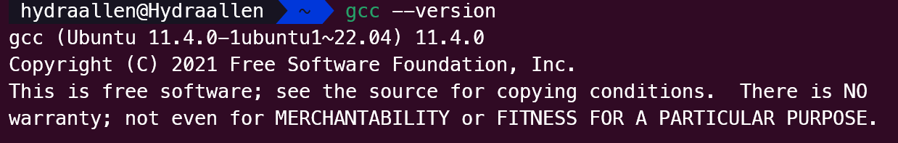
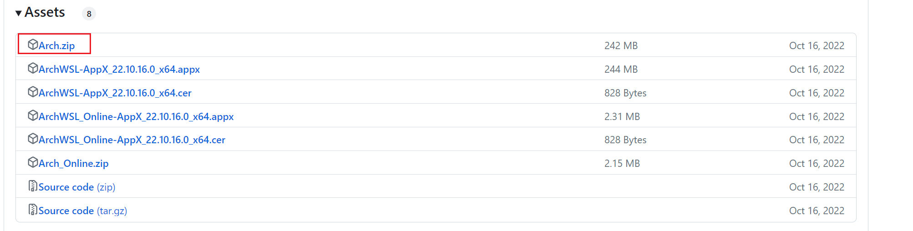
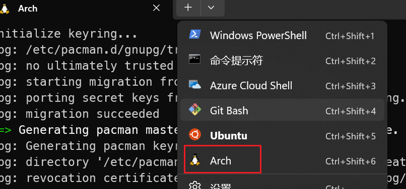
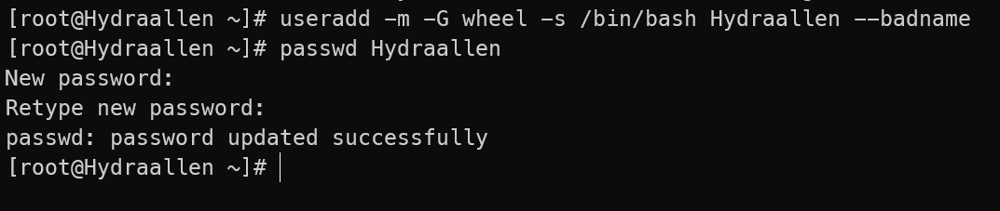
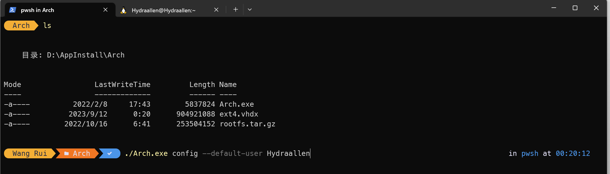
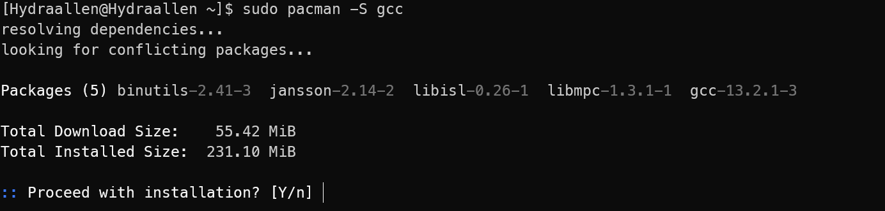

# **Linux Party**

2023-09-23

FOCS Group

---

# What is Linux

Linux kernel has just past its 32nd birthday.[^1] In many devices including web servers, desktop computers and mobile devices, you can find Linux kernel.

Linux kernel is not easy to manage, so people create and add many components and release various distributions.

Today, we will help you to install a Linux distribution on your computer. You can choose Ubuntu, one of popular Linux distributions, or a Debian based distribution which is developed to be used for JI courses. Also you can choose other distributions.

---

# Linux and Its Distributions


Screenshot from LinusTechTips


---

# FOCS Debian

- Has similar interface to Windows 10
- Developed from base system to avoid redundant software as in the official Debian images
- Aims to lower the time spent by students on installing software during labs
- Has the following software pre-installed:

<table style="display: block; margin: 0 auto;"><tr>
<td>

</td>
<td>

</td>
<td>

</td>
<td>

</td>
<td>

</td>
</tr></table> 

---

# Ways to get a Linux system

- Use WSL
- Use virtual machine 
- Install a dual boot system
- Only use Linux

---
## Use WSL

If you use windows, it is the easiest way for you to have a Linux environment.

If you want windows do everything (having no choices on installation), 
1. start Powershell in administer mode.
2. Type `wsl --install`.
3. Wait and then reboot.

https://learn.microsoft.com/en-gb/windows/wsl/install

If your windows version is old, please follow https://learn.microsoft.com/en-gb/windows/wsl/install-manual

**Otherwise, check WSL Installation Guidence**

---

## WSL Installation Guidence

*Created by TechJI and 2023 151 TA Team.*
*Modified by FOCS Group.*


*This article uses a* [***CC BY-NC 2.0***](https://creativecommons.org/licenses/by-nc/2.0/) *license.*

**Requirements**

- Windows 10 1709 Fall Creators Update 64bit or later.
- Windows Subsystem for Linux feature is enabled.

---

### Step 1 Enable Linux feature

<table style="display: block; margin: 0 auto;"><tr>
<td>

</td>
<td>

</td>
</tr></table>

---

Then run on `Powershell` with administrator.
```bash
dism.exe /online /enable-feature /featurename:Microsoft-Windows-Subsystem-Linux /all /norestart
```

<table style="display: block; margin: 0 auto;"><tr>
<td>

</td>
</tr></table>

*Reminder*

When you use WSL2, Hyper-V is enabled, which is **NOT** compatible with other vm platforms like VMWare and VirtualBox.

Think twice before using it.

---

### Step 2 Check whether your PC support WSL2
   - In cmd run `systeminfo`
   - Scroll down to Hyper-V section
   - If there are 4 "Yes" OR " A hypervisor has been detected. Features required for Hyper-V will not be displayed." ("已检测到虚拟机监控程序。将不显示 Hyper-V 所需的功能。"), then your PC is OK
   - Otherwise it's not OK, please use WSL1 or other vm platform

---

### Step 3 Setup wsl2

```bash
wsl --set-default-version 2
```


---

#### Case 1: No error
- Just enjoy your WSL2

#### Case 2: Error with link https://aka.ms/wsl2kernel attatched
- Go to https://aka.ms/wsl2kernel and download a patch
- start wsl2 again
  
#### Case 3: Error telling you Hyper-V is not enabled
- Go to Control Panel (控制面板) > Programs (程序) > Turn Windows features on or off (启用或关闭Windows功能)
- Find Hyper-V

---

##### Case 3.1: No Hyper-V Settings
- You should check whether your PC support WSL2. See above.

##### Case 3.2: All 4 settings in Hyper-V can be ticked
- Tick all settings 
- Restart your PC
- Try to start wsl2 again

---

##### Case 3.3: Some of the settings can't be ticked
This might be an issue with your hardware. Please refer to section "How to Enable Hardware Virtualization in BIOS" in https://www.makeuseof.com/windows-11-enable-hyper-v/ and try to enable hardware virtualization. (My laptop thinkpad has this issue)

##### Case 3.4 Otherwise
- Search online with error message on your screen (better go to stackoverflow/microsoft doc/github issues)
- Just use WSL1. It has no big issue.

---

### Step 4 Install Linux 

- Ubuntu
- arch
You only need choose **one**.

---

#### Ubuntu

Go to Microsoft Store and search "Ubuntu"


Download one of them.

---

Open your terminal and choose `ubuntu`.

Setup your user name and password.


---

run

```bash
$ sudo apt update
$ sudo apt install build-essential
$ gcc --version
```




---


#### Arch

You may refer to the official website.

Here, we demonstrate the first method.


1. [Download](https://github.com/yuk7/ArchWSL/releases/latest) the installer zip.



---

2. Extract all files in zip file to the same directory. Please extract to a folder that you have write permission. For example, `C:\Program Files` cannot be used since the rootfs cannot be modified there.


3. Run `Arch.exe` to extract the rootfs and register to WSL


As a side note, the executable name is what is used as the WSL instance name. If you rename it, you can have multiple installs.

---

4. Open your terminal and choose `arch`.



---

5. Setting the root password

```bash
passwd
```


---


6. Set up the default user

```bash
$ echo "%wheel ALL=(ALL) ALL" > /etc/sudoers.d/wheel
$ useradd -m -G wheel -s /bin/bash {username}
$ passwd {username}
```



---

```bash
$ exit
$ Arch.exe config --default-user {username}
```



If the default user has not been changed ([issue #7](https://github.com/yuk7/ArchWSL/issues/7)), please reboot the computer or alternatively, restart the LxssManager in an Admin command prompt. *Please refer to the official documentation.*

---

7.  initialize the keyring

```bash
$ sudo pacman-key --init
$ sudo pacman-key --populate
$ sudo pacman -Sy archlinux-keyring
$ sudo pacman -Su
```


---

8. Install gcc

```bash
$ sudo pacman -S gcc
```



---

9. test gcc

```bash
$ gcc --version
```


---


## Use virtual machine 
You may choose VirtualBox or VMware.

https://software.sjtu.edu.cn/List/VirtualBox/virtualbox

1. Get the image (an `.iso` file) from the net.
2. Download and install the virtual machine software you want to use.
3. In the software, choose to create a virtual machine.
4. Choose the iso file you get.
5. Follow the instructions.

---

## Install a dual boot system

Be careful! Your data may be lost. **Make a backup** before you do the following steps.

1. Have a free disk partition. Have a USB disk.
2. Get the image (an `.iso` file) from the net.
3. Use tools like [rufus](https://rufus.ie/en/) to burn the iso into your USB disk.
4. Search online how to enter bios or uefi(different laptops require different key.) 
5. shutdown and then boot and enter bios or uefi.
6. Enable start from USB. Choose your USB disk to boot. Disable Secure Boot.
7. Boot and follow the setup steps.

When you choose the disk, be sure to check whether it is your **prepared free disk**.

---
## Only use Linux

The same as dual boot system. The only difference is to choose to install on your current system disk. 

*Your current system will **disappear**. All the data on your system disk will be **deleted**.*

---

# Setup your system

If you use WSL, your system will be setup by windows. You do not need to do anything.

Follow the instructions on the screen.

Here are some remainders.
1. Choose English. Do not use Chinese. It may cause many issues.
2. When choose the disk, be ***careful*** if you are not using virtual machine. It is recommend to have one partition for `/` and one partition for `/home/{yourname}` because you may have serval times erasing the system and reinstalling the system. 
---
# Start to use

1. Start Terminal.
2. Type `apt update` (apt is the package manager for debian-based systems. Yes, ubuntu is a debian-based system.)
3. Install git, compiles and other tools you want to use by `apt install <name>`.

---
# Well known tools you could use in Linux
- Chrome, Edge, 360 Browser ... -> Firefox
- Microsoft Office -> Libre office, WPS(not opensource)
- App store -> apt (and many UI store integrated with apt)
- Chinese Input tools -> Sogou Pinyin(not opensource), Rime

[^1]: https://www.phoronix.com/news/Linux-6.6-rc2-Released
