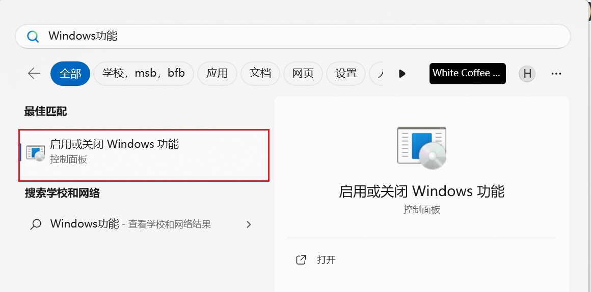
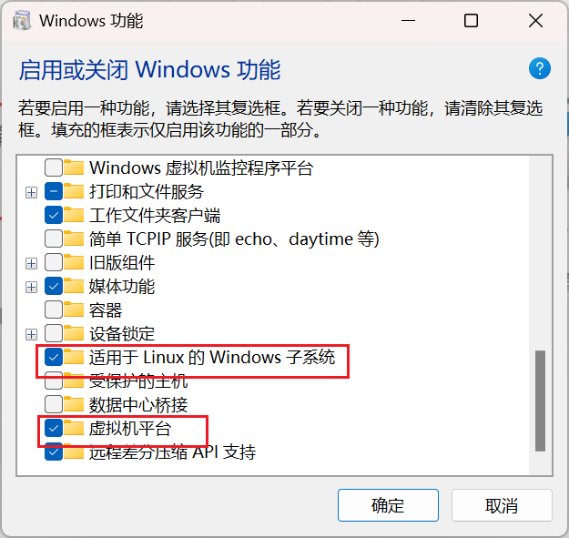
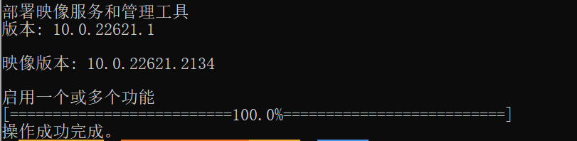
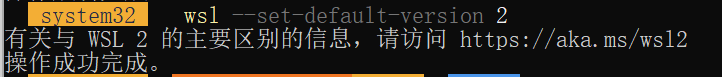
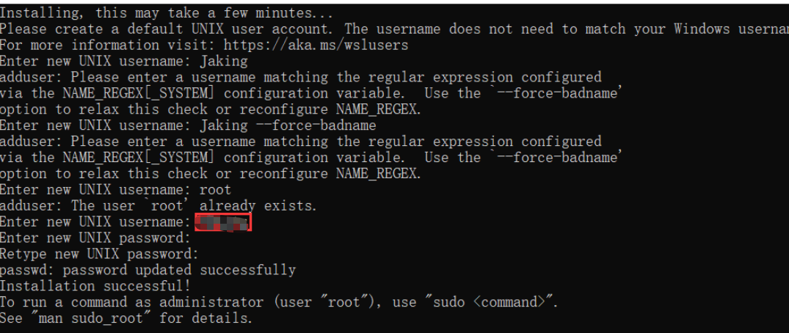
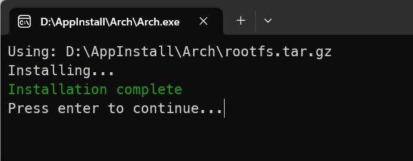
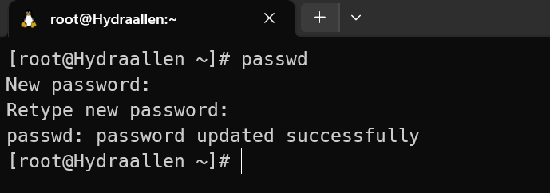
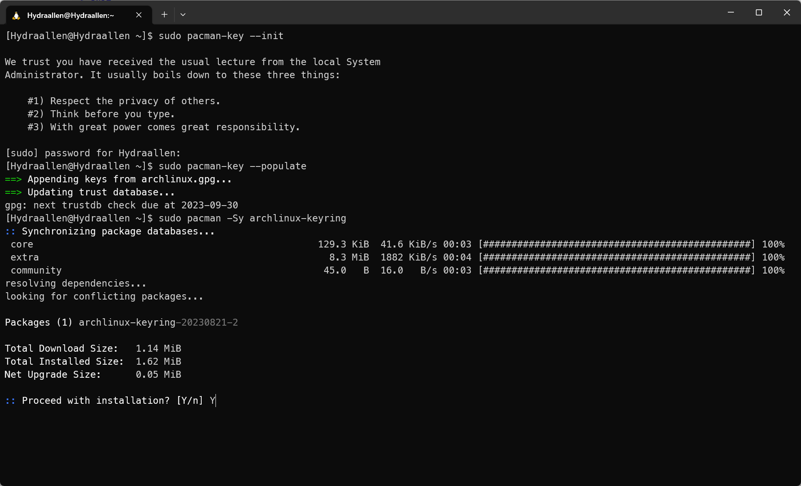
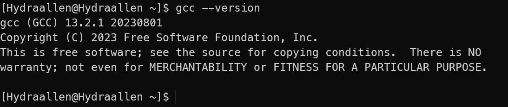

# **WSL Installation Guidence**

*Created by TechJI and 2023 151 TA Team.*


*This article uses a* [***CC BY-NC 2.0\***](https://creativecommons.org/licenses/by-nc/2.0/) *license.*

### Windows (using wsl)

#### Requirements

- Windows 10 1709 Fall Creators Update 64bit or later.
- Windows Subsystem for Linux feature is enabled.

1. To enable Linux feature






Then run on `Powershell` with administrator

```bash
dism.exe /online /enable-feature /featurename:Microsoft-Windows-Subsystem-Linux /all /norestart
```



### Reminder

When you use WSL2, Hyper-V is enabled, which is **NOT** compatible with other vm platforms like VMWare and VirtualBox.

Think twice before using it.

2. Check whether your PC support WSL2:
   - In cmd run `systeminfo`
   - Scroll down to Hyper-V section
   - If there are 4 "Yes" OR " A hypervisor has been detected. Features required for Hyper-V will not be displayed." ("已检测到虚拟机监控程序。将不显示 Hyper-V 所需的功能。"), then your PC is OK
   - Otherwise it's not OK, please use WSL1 or other vm platform

3. Setup wsl2

```bash
wsl --set-default-version 2
```



#### Case 1: No error
- Just enjoy your WSL2

#### Case 2: Error with link https://aka.ms/wsl2kernel attatched
- Go to https://aka.ms/wsl2kernel and download a patch
- start wsl2 again
  
#### Case 3: Error telling you Hyper-V is not enabled
- Go to Control Panel (控制面板) > Programs (程序) > Turn Windows features on or off (启用或关闭Windows功能)
- Find Hyper-V

##### Case 3.1: No Hyper-V Settings
- You should check whether your PC support WSL2. See above.

##### Case 3.2: All 4 settings in Hyper-V can be ticked
- Tick all settings 
- Restart your PC
- Try to start wsl2 again

##### Case 3.3: Some of the settings can't be ticked
This might be an issue with your hardware. Please refer to section "How to Enable Hardware Virtualization in BIOS" in https://www.makeuseof.com/windows-11-enable-hyper-v/ and try to enable hardware virtualization. (My laptop thinkpad has this issue)

##### Case 3.4 Otherwise
- Search online with error message on your screen (better go to stackoverflow/microsoft doc/github issues)
- Just use WSL1. It has no big issue.

4. Install Linux (Ubuntu/arch, you only need choose **one**)

#### Ubuntu

Go to Microsoft Store and search "Ubuntu"


Download one of them.

Open your terminal and choose `ubuntu`.

Setup your user name and password.



run

```bash
$ sudo apt update
$ sudo apt install build-essential
$ gcc --version
```


#### Arch

You may refer to the official website.

Here, we demonstrate the first method.


1. [Download](https://github.com/yuk7/ArchWSL/releases/latest) the installer zip.


2. Extract all files in zip file to the same directory. Please extract to a folder that you have write permission. For example, `C:\Program Files` cannot be used since the rootfs cannot be modified there.


3. Run `Arch.exe` to extract the rootfs and register to WSL



As a side note, the executable name is what is used as the WSL instance name. If you rename it, you can have multiple installs.

4. Open your terminal and choose `arch`.


5. Setting the root password

```bash
passwd
```



6. Set up the default user

```bash
$ echo "%wheel ALL=(ALL) ALL" > /etc/sudoers.d/wheel
$ useradd -m -G wheel -s /bin/bash {username}
$ passwd {username}
```


```bash
$ exit
$ Arch.exe config --default-user {username}
```


If the default user has not been changed ([issue #7](https://github.com/yuk7/ArchWSL/issues/7)), please reboot the computer or alternatively, restart the LxssManager in an Admin command prompt. *Please refer to the official documentation.*

7.  initialize the keyring

```bash
$ sudo pacman-key --init
$ sudo pacman-key --populate
$ sudo pacman -Sy archlinux-keyring
$ sudo pacman -Su
```



8. Install gcc

```bash
$ sudo pacman -S gcc
```


9. test gcc

```bash
$ gcc --version
```



## Reference

1. https://learn.microsoft.com/en-gb/windows/wsl/install If your windows version is old, please follow https://learn.microsoft.com/engb/windows/wsl/install-manual
